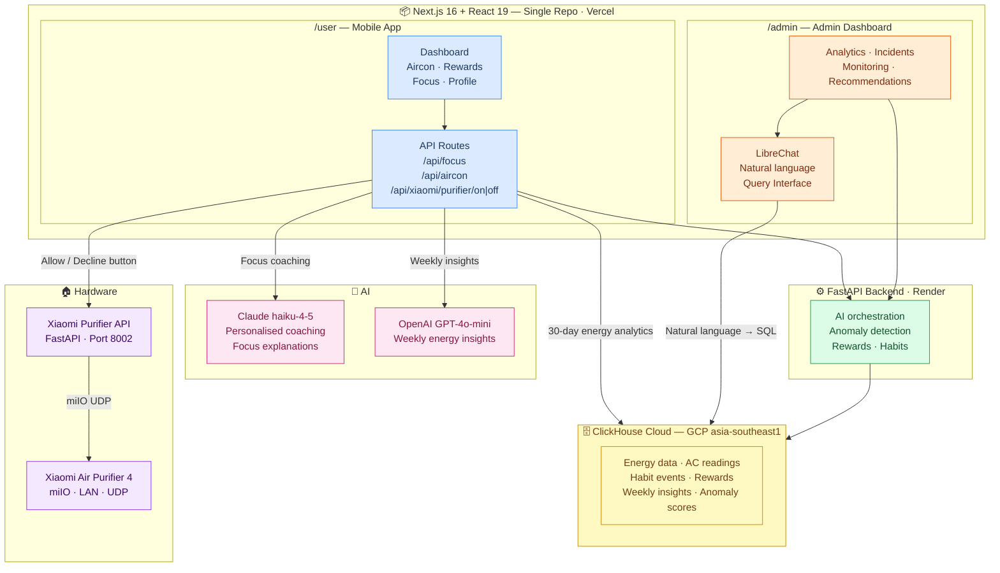
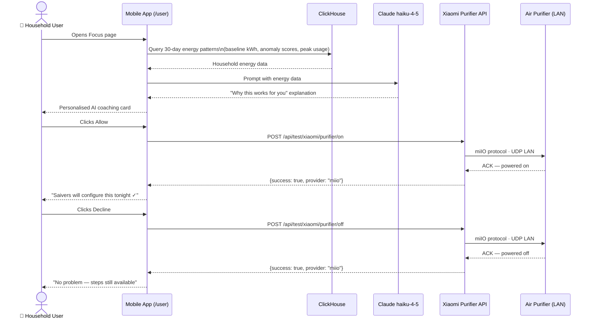
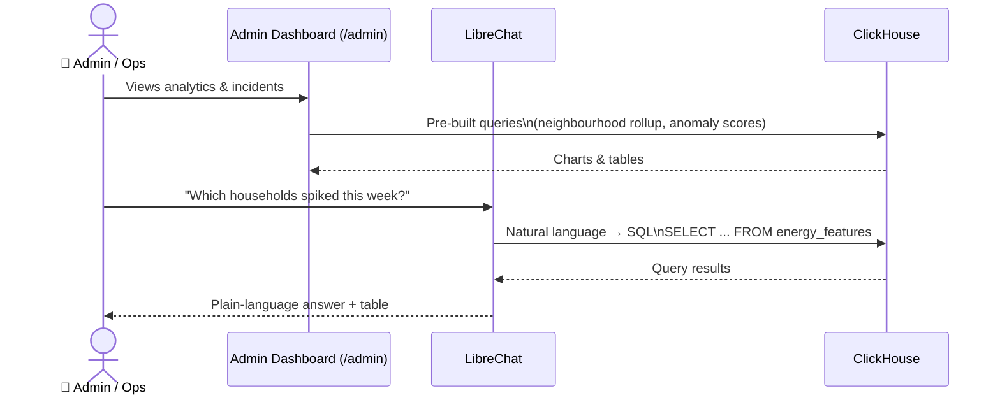

# Saivers — Architecture

> AI-powered energy behaviour coach · HackOMania 2026

---

## Two Interfaces, One Codebase

---

## Mobile App — AI + ClickHouse + Hardware

---

## Admin Dashboard — LibreChat + ClickHouse

---

## Key Technologies

| Interface | Technology | What It Does |
|-----------|-----------|--------------|
| **Mobile App** | Next.js · **ClickHouse** · **Claude haiku-4-5** · **OpenAI** · **python-miio** | Energy coaching + AI explanations + physical device control |
| **Admin Dashboard** | Next.js · **ClickHouse** · **LibreChat MCP** | Natural language energy analytics for ops team |
| Shared Backend | FastAPI · Python 3.14 | AI orchestration, anomaly detection, rewards, habits |
