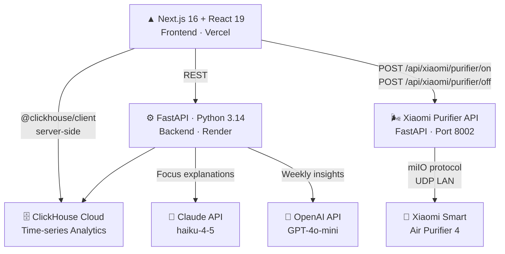
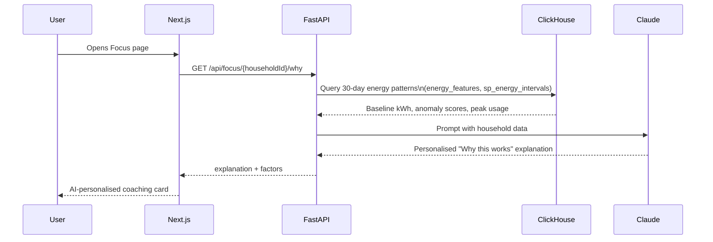
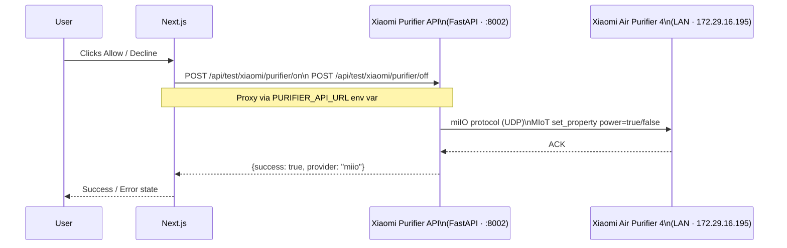

# Saivers — Architecture

> AI-powered energy behaviour coach · HackOMania 2026

---

## Tech Stack

---

## AI + ClickHouse — How It Works

---

## Xiaomi Smart Device Integration

---

## Key Technologies

| Layer | Technology | Purpose |
|-------|-----------|---------|
| Frontend | Next.js 16, React 19, Tailwind v4 | Mobile-first user app |
| Backend | FastAPI, Python 3.14 | API, AI orchestration |
| Database | **ClickHouse Cloud** | Half-hourly energy analytics |
| AI Coaching | **Claude haiku-4-5** | Personalised focus explanations |
| AI Insights | **OpenAI GPT-4o-mini** | Weekly energy summaries |
| Smart Device | **Xiaomi Purifier + python-miio** | Physical device control via LAN |
