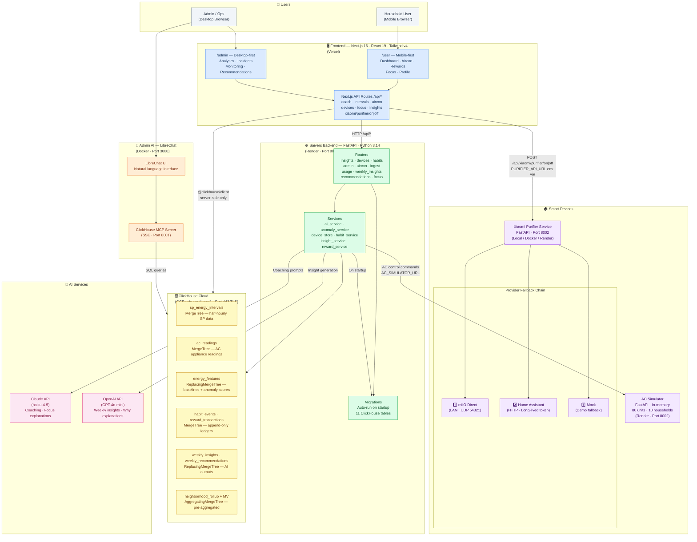
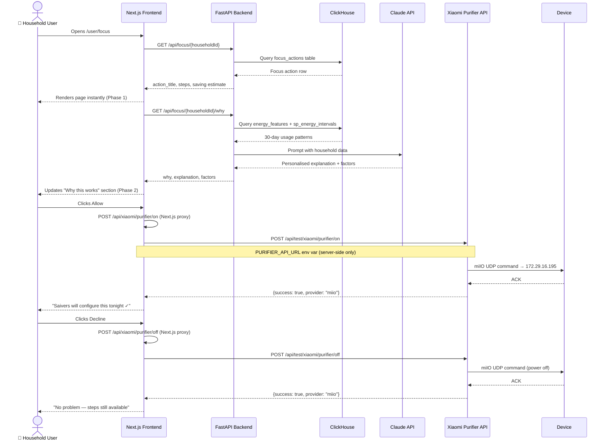
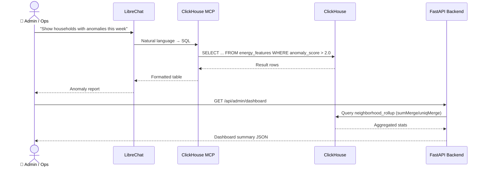
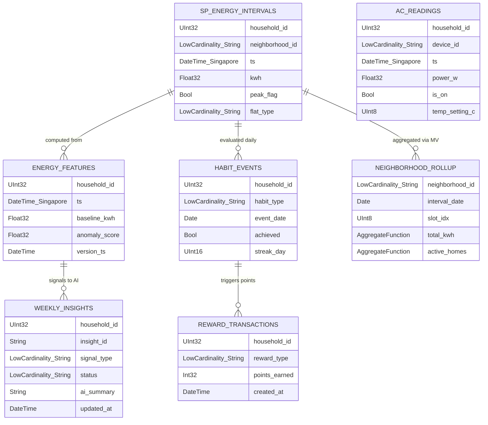
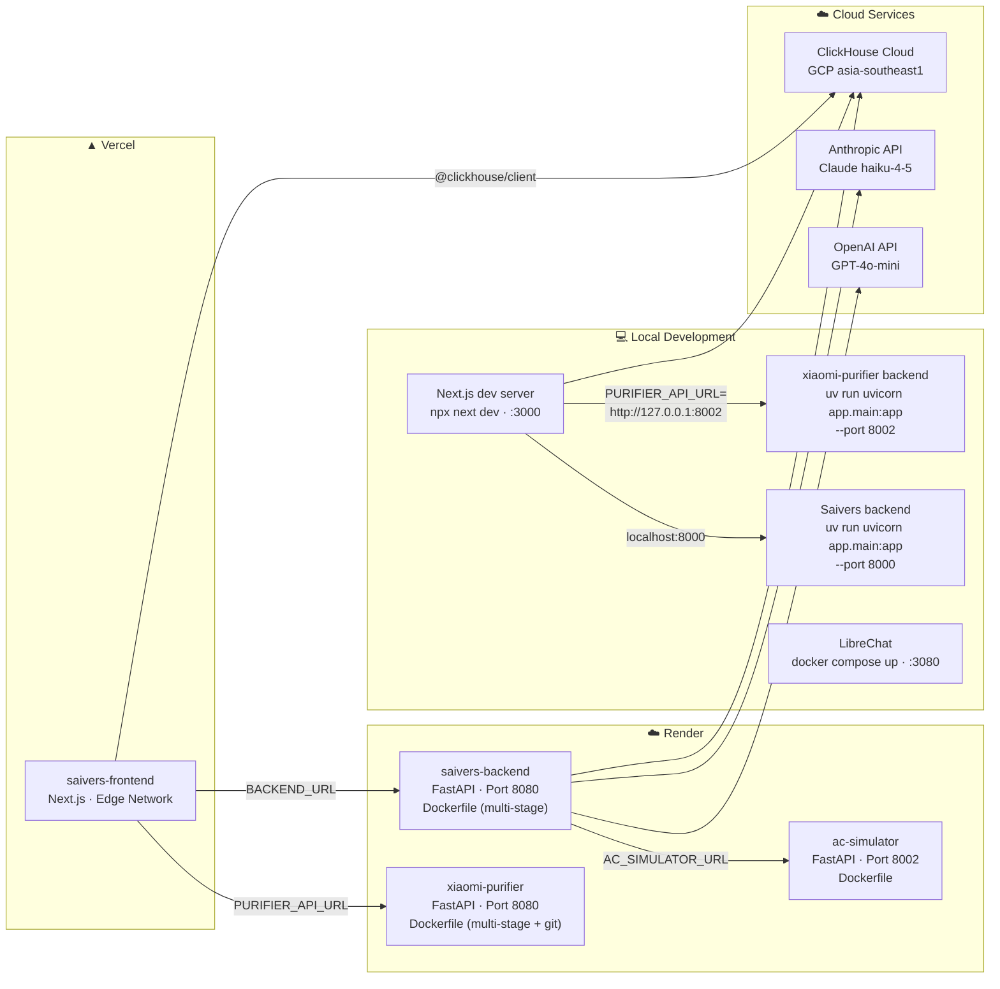

# Saivers — System Architecture

> AI-powered energy behaviour coach for Singapore households · HackOMania 2026

---

## High-Level Architecture

---

## Data Flow — User Focus Page + Purifier Control

---

## Data Flow — Admin Monitors Household

---

## ClickHouse Schema

---

## Deployment Architecture

---

## Component Summary

| Component | Tech | Port | Hosts | Role |
|-----------|------|------|-------|------|
| **Frontend** | Next.js 16, React 19, Tailwind v4, Recharts | 3000 | Vercel | User + Admin UI, API proxy routes |
| **Saivers Backend** | FastAPI, Python 3.14, clickhouse-connect | 8000 → 8080 | Render | 11 routers, AI orchestration, DB writes |
| **ClickHouse** | ClickHouse Cloud | 443 TLS | GCP asia-southeast1 | Time-series analytics, 11 tables |
| **AC Simulator** | FastAPI, Python | 8002 | Render | 80 virtual AC units, SSE live stream |
| **Xiaomi Purifier** | FastAPI, python-miio | 8002 (local) / 8080 (Render) | Local / Render | Real device control: miIO → HA → Mock |
| **LibreChat** | Docker, ClickHouse MCP | 3080 | Local | Admin natural-language ClickHouse queries |
| **Claude API** | Anthropic haiku-4-5 | — | Cloud | Focus explanations, coaching copy |
| **OpenAI API** | GPT-4o-mini | — | Cloud | Weekly insights, anomaly explanations |

---

## Domain Constants

| Constant | Value |
|----------|-------|
| Households | 1001 Ahmad · Punggol · 5-room · ~S$97/wk |
| | 1002 Priya · Jurong West · 4-room · ~S$44/wk |
| | 1003 Wei Ming · Bedok · 3-room · ~S$36/wk |
| Neighbourhood | `toa-payoh` (hardcoded for demo) |
| Tariff | S$0.2911 / kWh (SP Group Q1 2026) |
| CO₂ Factor | 0.402 kg CO₂ / kWh (EMA 2024) |
| Peak Window | 19:00–23:00 SGT (`peak_flag = true`, slots 38–45) |
| CDC Voucher | 500 pts = S$5 |
| Streak Milestones | 7d → +100 pts · 14d → +250 pts · 30d → +500 pts |
| Room Mapping | 1001→master-room · 1002→room-1 · 1003→room-2 · 1004→living-room |
